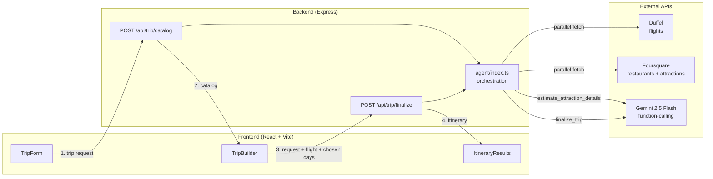

# Travel Planner

Give it an origin, a destination, dates, and a budget — it finds real flights, restaurants, and
attractions for the destination, and you build your own day-by-day plan from them.

The backend calls real APIs (Duffel for flights, Foursquare for restaurants/attractions) and uses Gemini for the two jobs that actually need model judgment estimating how long each attraction takes to visit and its typical hours, and estimating hotel/food/ activity cost and budget fit once you've built your plan rather than a single prompt making everything up.

## Architecture

## Known limitations

- **No persistence** — everything lives in component state; refreshing the page loses the in-progress trip. There's no database and no user accounts.
  *Fixable* — add a `trips` table (Postgres/SQLite) and a save/load endpoint, or persist to `localStorage` as a lighter first step for anonymous session recovery.
- **No auth or rate limiting** on the API routes beyond what Gemini/Foursquare/Duffel enforce themselves — anyone with the backend URL can spend the API quotas.
  *Fixable* — bolt on an API key/JWT check plus a per-IP or per-user rate limiter in front of both routes in `server.ts`; no architectural change needed.
- **Hotel pricing is always an AI estimate**, never a live bookable rate.
  *Fixable, conditionally* — the moment a free/affordable live hotel-pricing API exists (or the project's budget allows a paid one), swap `finalizeTrip`'s hotel estimate for a real `clients/<provider>.ts` call the same way `duffel.ts`/`foursquare.ts` are wired in; the AI-estimate path was written to be that plug's fallback, not a permanent design choice.