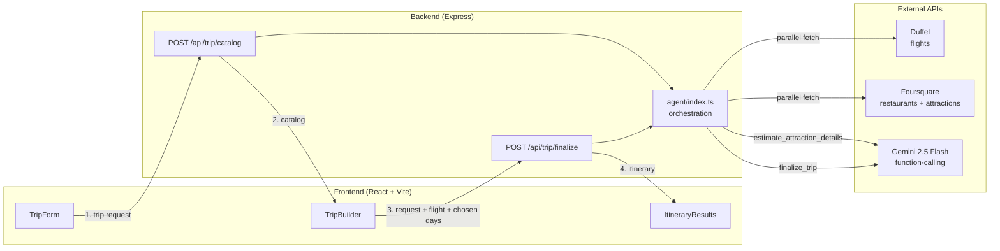

# Travel Planner

Give it an origin, a destination, dates, and a budget — it finds real flights, restaurants, and
attractions for the destination, and you build your own day-by-day plan from them.

This is an **agentic** app: the backend calls real APIs (Duffel for flights, Foursquare for
restaurants/attractions) and uses Gemini for the two jobs that actually need model judgment —
estimating how long each attraction takes to visit and its typical hours, and estimating hotel/food/
activity cost and budget fit once you've built your plan — rather than a single prompt making
everything up.

## Contents

- [Architecture](#architecture)
- [System design](#system-design)
- [Data sources](#data-sources)
- [Project structure](#project-structure)
- [API reference](#api-reference)
- [Setup](#setup)
- [Testing](#testing)
- [Deploying to Vercel](#deploying-to-vercel)
- [Known limitations](#known-limitations)

## Architecture

Two independently deployable services, both TypeScript: a Vite/React SPA and an Express API. The
API is the only thing that talks to external providers — the frontend never sees a Gemini,
Foursquare, or Duffel key.



**Why two phases instead of one big call:** the catalog phase is pure data retrieval (plus one
small AI enrichment step) and can run the two provider calls in parallel. The finalize phase only
runs once the traveler has actually picked meals and activities, so the budget estimate reflects
their real plan instead of a guess made before they'd chosen anything.

## System design

### Backend layering

```
server.ts        → HTTP layer: request validation, error mapping, routing. No business logic.
agent/index.ts    → Orchestration: fan-out to clients, shape data for Gemini, unpack tool-call results.
agent/tools.ts    → Gemini function-declaration schemas (the contract the model must fill in).
clients/duffel.ts     → Duffel adapter: IATA resolution → offer search → cheapest-offer selection.
clients/foursquare.ts → Foursquare adapter: category-filtered place search → PlaceResult mapping.
types.ts          → Shared domain types (mirrored in frontend/src/types.ts).
```

Each layer only knows about the one below it — `server.ts` never imports a client directly, and the
clients never know Gemini exists. That keeps the two external-data integrations swappable without
touching the AI orchestration, and vice versa.

### AI usage: constrained function-calling, not freeform prompting

Both Gemini calls set `functionCallingConfig.mode = ANY` with a single `allowedFunctionNames` entry,
so the model is forced to return one specific structured payload rather than prose. This buys three
things:

1. **Type safety** — the response is parsed as the declared schema, no regex/markdown scraping.
2. **Determinism under failure** — if the model returns fewer entries than requested (seen with the
   attraction-duration batch call), the code falls back to sane defaults per-item instead of
   crashing or misaligning results.
3. **Auditability** — `agent/tools.ts` is the single source of truth for what the model is allowed
   to produce; changing the AI's behavior means changing a schema, not a prompt.

**AI use case 1 — attraction enrichment** (`annotateAttractions`): Foursquare's free tier doesn't
return opening hours or visit duration. Rather than call Gemini once per place, all attractions for
a destination are batched into a single ordered prompt (`estimate_attraction_details`), and the
response is validated to have one entry per input in the same order before being zipped back onto
the place data.

**AI use case 2 — budget-aware finalization** (`finalizeTrip`): once the traveler has picked real
meals and activities, Gemini estimates a plausible hotel + food/activity cost for *that specific
plan* against the budget remaining after flights (`finalize_trip`), and — only when the total comes
out over budget — generates concrete trim-down suggestions. No hotel-pricing API has a viable free
tier, so this is explicitly surfaced to the user as an estimate, not a live price.

### Frontend: a three-phase state machine

`App.tsx` holds a single `phase: "form" | "building" | "results"` state and renders one page per
phase — there's no router, because the flow is strictly linear and each phase depends on data
produced by the previous one (you can't build a day plan before you have a catalog; you can't see
an itinerary before you've finalized a plan).

`TripBuilder` (the "building" phase) enforces one cross-cutting UI rule at render time rather than
in shared state: an attraction checked on one day is filtered out of every other day's option list,
computed per-day from the full `days` array on each render (`!days.some((d, di) => di !== i &&
d.activities.includes(a.name))`). A per-day "Other" checkbox reveals a free-text input for
attractions outside the fetched catalog, tracked as separate local UI state and merged into that
day's `activities` array so the backend sees a single flat list either way.

### Error handling

- Every request body is manually validated against the expected shape in `server.ts` before it
  reaches the agent layer — malformed input never reaches an external API call.
- Gemini `429` (daily quota) responses are caught and rewritten to a user-facing "Today's quota
  reached" message instead of a raw API error.
- Duffel is optional: if `DUFFEL_API_KEY` is unset, flight search is skipped entirely (logged once
  at startup) and the rest of the pipeline runs unaffected — the app degrades gracefully rather than
  failing closed.

## Data sources

- **Planning:** [Google Gemini API](https://aistudio.google.com/apikey) — free tier.
- **Restaurants & attractions:** [Foursquare Places API](https://location.foursquare.com/developer/) — free tier.
- **Flights:** [Duffel API](https://duffel.com/) — free test-mode signup, no travel-agency accreditation needed.
- **Hotels:** no reliable free live-pricing API exists (Amadeus's free self-service tier is gone; every
  free "hotel API" found either requires RapidAPI, a paid trial, or is an unvetted scraper). Instead,
  Gemini estimates a reasonable hotel and nightly rate — clearly labeled as an estimate, not a
  live/bookable price.
- **Attraction duration & hours:** Foursquare's free tier doesn't return real opening hours, so these
  are also Gemini estimates, labeled as such in the UI.

## Project structure

```
backend/
  src/
    server.ts              # Express app, routes, request validation
    types.ts                # Domain types shared (by mirror) with the frontend
    agent/
      index.ts              # Orchestration: fan-out to clients, Gemini calls, response shaping
      tools.ts               # Gemini function-declaration schemas
    clients/
      duffel.ts              # Flight search adapter
      foursquare.ts           # Restaurant/attraction search adapter
  tests/agent/               # Vitest coverage: budget math, catalog build, finalize, tool schemas

frontend/
  src/
    App.tsx                  # Phase state machine (form → building → results)
    api/client.ts             # Typed fetch wrappers for the two API routes
    pages/
      TripForm.tsx             # Phase 1: trip parameters
      TripBuilder.tsx           # Phase 2: day-by-day meal/activity picker
      ItineraryResults.tsx      # Phase 3: finalized itinerary + budget breakdown
    types.ts                  # Domain types (mirrors backend/src/types.ts)
```

## API reference

| Method | Path                 | Body                                             | Returns          |
|--------|----------------------|---------------------------------------------------|-------------------|
| POST   | `/api/trip/catalog`  | `TripRequest`                                     | `TripCatalog` — flight (optional), restaurants, attractions |
| POST   | `/api/trip/finalize` | `{ request: TripRequest, flight?, days: DayPlan[] }` | `Itinerary` — day summaries, hotel estimate, budget breakdown, suggestions |
| GET    | `/api/health`        | —                                                 | `{ ok: true }`    |

See `backend/src/types.ts` for the full shape of `TripRequest`, `TripCatalog`, `DayPlan`, and
`Itinerary`.

## Setup

### 1. Get API keys

- Gemini: create a free key at [aistudio.google.com/apikey](https://aistudio.google.com/apikey)
- Foursquare: sign up at [location.foursquare.com/developer](https://location.foursquare.com/developer/) and create a project API key (uses the new `places-api.foursquare.com` endpoint, Bearer auth — see `backend/src/clients/foursquare.ts`)
- Duffel: sign up at [duffel.com](https://duffel.com/) (~1 minute, no accreditation needed), go to Developers → Access tokens, and copy a **test** token

### 2. Backend

```bash
cd backend
cp .env.example .env   # fill in GEMINI_API_KEY, FOURSQUARE_API_KEY, DUFFEL_API_KEY
npm install
npm run dev             # starts on http://localhost:3001
```

Leaving `DUFFEL_API_KEY` blank is fine — the server logs a warning and just skips flight search.

### 3. Frontend

```bash
cd frontend
npm install
npm run dev             # starts on http://localhost:5173, proxies /api to the backend
```

Open http://localhost:5173, fill in the trip form, and submit.

## Testing

```bash
cd backend
npm test
```

Covers budget-breakdown math, catalog assembly, trip finalization, and the Gemini tool schemas.
There is currently no frontend test suite (see [Known limitations](#known-limitations)).

## Deploying to Vercel

The backend (Express) and frontend (Vite) deploy as **two separate Vercel projects** from the same
repo — Vercel auto-detects both frameworks, so no custom `vercel.json` is needed.

1. **Push this repo to GitHub** (or use the `vercel` CLI to deploy from your machine without git).
2. **Backend project**: on [vercel.com](https://vercel.com), "Add New Project" → import the repo →
   set **Root Directory** to `backend`. Vercel detects the Express app automatically (it looks for
   `src/server.ts`, which is exactly where ours is). In the project's **Settings → Environment
   Variables**, add `GEMINI_API_KEY`, `FOURSQUARE_API_KEY`, and `DUFFEL_API_KEY` with your real
   values. Deploy, then copy the resulting URL (e.g. `https://your-backend.vercel.app`).
3. **Frontend project**: "Add New Project" again → same repo → **Root Directory** set to `frontend`.
   Vercel auto-detects Vite. Add one environment variable: `VITE_API_BASE_URL` = the backend URL from
   step 2 (no trailing slash). Deploy.
4. Open the frontend's Vercel URL — it now calls the deployed backend instead of localhost.

Notes:
- Never commit `.env`/`.env.local` — both `.gitignore` files already exclude them; enter real keys
  only in each Vercel project's dashboard.
- Gemini's free tier caps at **20 requests/day** per project — fine for testing, but worth knowing
  before demoing this to others.
- Vercel's current default function duration (300s on Hobby, via Fluid Compute) comfortably covers
  this app's sequential external API calls, so no extra timeout configuration is needed.

## Known limitations

- **No persistence** — everything lives in component state; refreshing the page loses the in-progress
  trip. There's no database and no user accounts.
  *Fixable* — add a `trips` table (Postgres/SQLite) and a save/load endpoint, or persist to
  `localStorage` as a lighter first step for anonymous session recovery.
- **No auth or rate limiting** on the API routes beyond what Gemini/Foursquare/Duffel enforce
  themselves — anyone with the backend URL can spend the (shared) API quotas.
  *Fixable* — bolt on an API key/JWT check plus a per-IP or per-user rate limiter
  (e.g. `express-rate-limit`) in front of both routes in `server.ts`; no architectural change needed.
- **Hotel pricing is always an AI estimate**, never a live bookable rate (see [Data sources](#data-sources)).
  *Fixable, conditionally* — the moment a free/affordable live hotel-pricing API exists (or the
  project's budget allows a paid one), swap `finalizeTrip`'s hotel estimate for a real
  `clients/<provider>.ts` call the same way `duffel.ts`/`foursquare.ts` are wired in; the AI-estimate
  path was written to be that plug's fallback, not a permanent design choice.
- **Frontend has no automated test coverage** — only the backend agent logic is under Vitest.
  *Fixable* — add Vitest + React Testing Library to `frontend/` (same runner as the backend, so no
  new tooling to learn) and start with the highest-value case: the `TripBuilder` cross-day
  checkbox-exclusion logic, since that's pure UI logic with no external API to mock.
- **Gemini free tier is capped at 20 requests/day** per project, which limits how much this can be
  demoed or load-tested without a paid tier.
  *Fixable* — upgrade to a paid Gemini tier (no code changes required, it's the same API), or add
  response caching per destination so repeat demos of the same city don't re-spend quota.
